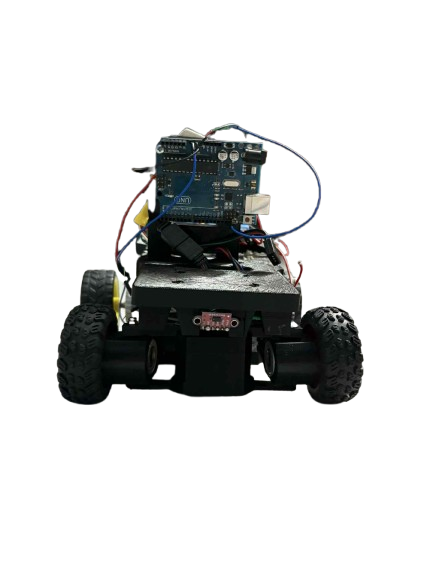
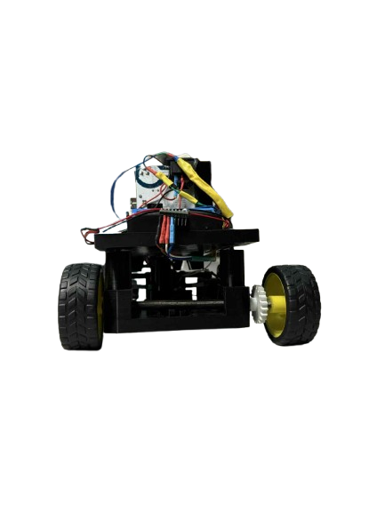
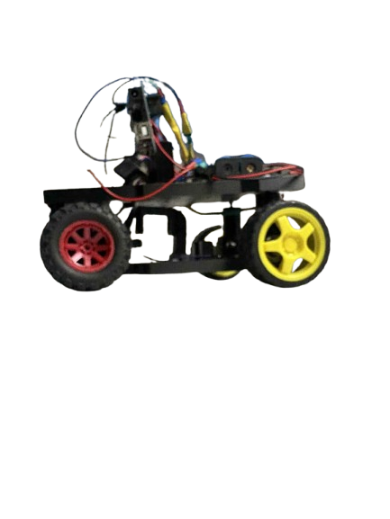
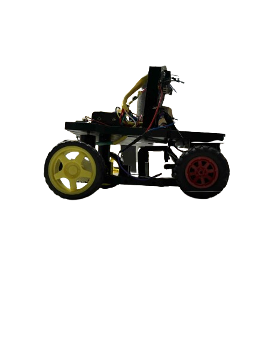
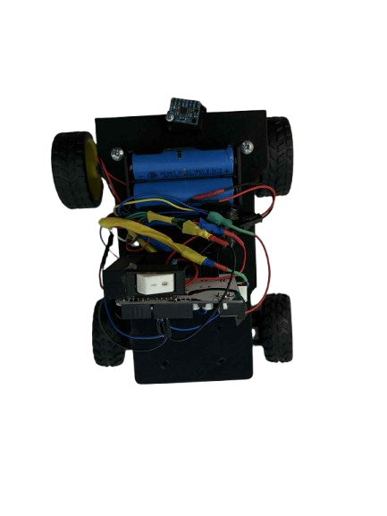
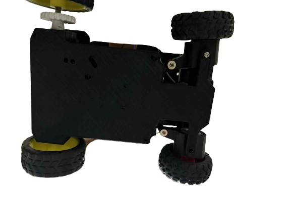
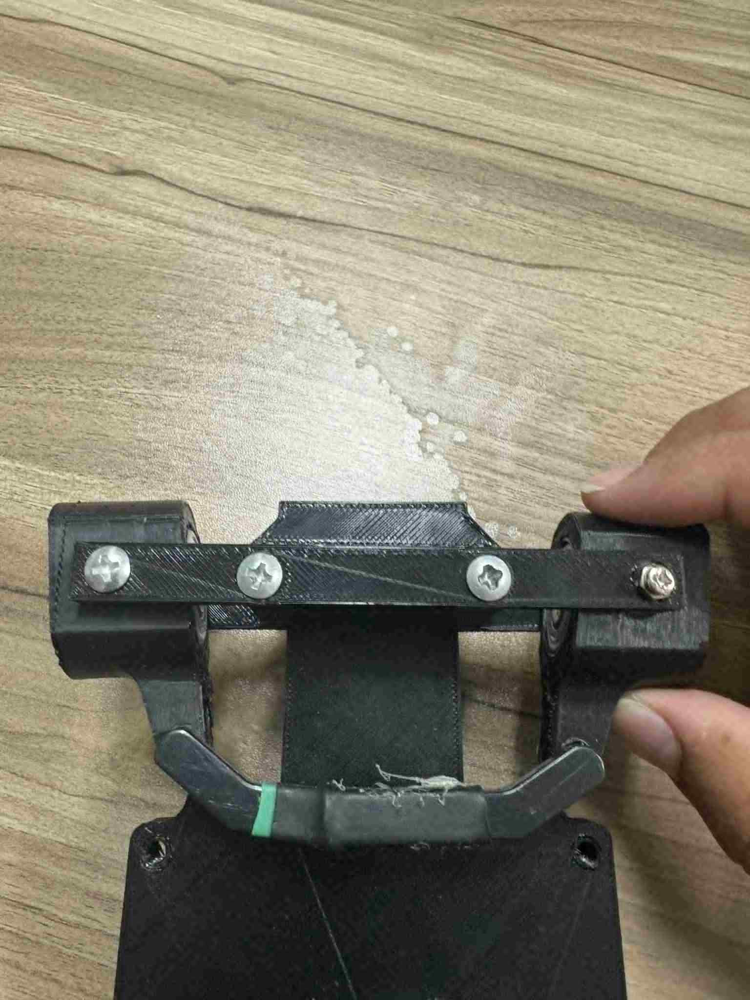

<div align="center">


[](https://wro-association.org/)
[](https://www.instagram.com/axivio2025/)
[](https://www.youtube.com/@Axivio-e1g)
[](LICENSE)

**Official documentation for Axora**

[Watch Demo](#performance-video) • [Documentation](#table-of-contents) • [Build Guide](#robot-construction-guide) • [Source Code](#source-code)

</div>

---

## Table of Contents
* [The Team](#team)
* [The Challenge](#challenge)
* [The Robot](#robot-image)
* [Mobility Management](#mobility-management)
  * [Powertrain](#powertrain-mechanical)
    * [Drivetrain](#drivetrain-mechanical)
    * [Motor](#motor-mechanical)
    * [Motor Driver](#motor-driver-mechanical)
  * [Steering](#steering-mechanical)
    * [Servo Motor](#servo-motor)
  * [Chassis](#chassis-mechanical)
* [Power and Sense Management](#power-and-sense-management)
  * [Power Supply](#power-supply)
  * [Arduino Uno](#arduino-uno)
  * [MPU6050](#mpu6050)
  * [VL53L0X](#vl53l0x)
  * [Pixy2](#pixy2)
  * [Circuit Diagram](#circuit-diagram)
* [Code for each component](#code-for-each-component)
  * [Drive Motor](#drive-motor-code)
  * [Servo Motor](#servo-motor-code)
  * [IMU](#gyro-sensor-code)
* [Robot Construction Guide](#robot-construction-guide)
  * [Step 1: Print the 3D parts](#3d-printing)
  * [Step 2: Assemble the steering system](#steering-system-assembly)
  * [Step 3: Attach the wheels](#wheel-attachment)
* [Cost Report](#cost-report)
  * [3D Printing Costs](#3d-printing-costs)
  * [components costs](#components-costs)
* [License](#License)

---

## The Team <a class="anchor" id="team"></a>

<div align="center">


</div>

<tr>
<td align="center" width="50%">

### Othman Jaber


**Age:** 15 • **School:** King Talal Secondary School, Nablus

short message : Hi, I'm Othman from Palestine, and this is my first time competing in WRO. I'm interested in programming, robotics, and astronomy. I like learning new things, solving problems, and playing games.

Gmail : <othmanjaber78@gmail.com>

---

</td>
<td align="center" width="50%">

### Hamza Darawsheh


**Age:** 15 • **School:** The Islamiah Secondary School, Nablus

short message : Hey there! My name is Hamza, and I'm passionate about robotics and engineering. I enjoy working with electronics and programming, and I'm always excited to tackle new challenges. This WRO competition gives me the perfect opportunity to combine my interests in technology and problem-solving.

Gmail : <hamzadarawsheh321@gmail.com>
</td>
</tr>

---

<tr>
<td align="center" colspan="2">

### Hamed Zafer


**Role:** Coach

 Gmail : <Hamed7710@gmail.com>
 
---
</td>
</tr>

<div align="center">

### Team Photo


</div>

---

## The Challenge <a class="anchor" id="challenge"></a>

The **[WRO 2025 Future Engineers - Self-Driving Cars](https://wro-association.org/)** challenge invites teams to design, build, and program a robotic vehicle capable of driving autonomously on a racetrack that changes dynamically for each round. The competition includes two main tasks: completing laps while navigating randomized obstacles and successfully performing a precise parallel parking maneuver. Teams must integrate advanced robotics concepts such as computer vision, sensor fusion, and kinematics, focusing on innovation and reliability.

Learn more about the challenge [here](https://wro-association.org/wp-content/uploads/WRO-2025-Future-Engineers-Self-Driving-Cars-General-Rules.pdf).

## Axora - Our Robot <a class="anchor" id="robot-image"></a>


Here are some pictures of our robot from every side:
<table>
<tr>
<td align="center"><br/><b>Front</b></td>
<td align="center"><br/><b>Back</b></td>
<td align="center"><br/><b>Left</b></td>
</tr>
<tr>
<td align="center"><br/><b>Right</b></td>
<td align="center"><br/><b>Top</b></td>
<td align="center"><br/><b>Bottom</b></td>
</tr>
</table>
</div>

---

# Mobility Management <a class="anchor" id="mobility-management"></a>

The robot's mobility is managed by a combination of components, including the powertrain, steering system, and chassis. These elements work together to ensure the robot's smooth and efficient movement.

## Powertrain <a class="anchor" id="powertrain-mechanical"></a>

### Drivetrain <a class="anchor" id="drivetrain-mechanical"></a>

Our drivetrain uses a direct drive system where the DC motor is connected directly to the rear axle. The rear wheels are mounted on a common axle for synchronized movement, while the front wheels are mounted independently to allow for steering. This simple but effective design minimizes mechanical complexity while providing reliable propulsion.

**Potential Improvements**:
- Add a differential system for smoother turning
- Implement encoder feedback for precise distance measurement
- Consider gear reduction for better torque control

### Motor <a class="anchor" id="motor-mechanical"></a>

<table>
  <tr>
    <td width="50%" style="text-align: left;">
      
    </td>
    <td width="50%" style="text-align: left; vertical-align: top;">
      <h3>Specifications:</h3>
      <li>Voltage: 6V-12V (we used 9V)</li>
      <li>Current: 0.8A no load, 3.2A stall</li>
      <li>Speed: ~150 RPM at 9V</li>
      <li>Torque: ~2.5 kg·cm at 9V</li>
      <li>Weight: 55g</li>
    </td>
  </tr>
</table>

We selected a standard DC gearmotor for its simplicity and reliability. This motor provides sufficient torque for our robot while maintaining a compact form factor. The motor is secured to the chassis using a custom mounting bracket.

**Potential Improvements**:
- Add encoder for precise speed and position control
- Implement better motor mounting for reduced vibration
- Consider brushless motor for higher efficiency

to connect the dc motor with the wheels, we made this 3d design axle to connect between them.
 

this axle will be connected like this:


> [!NOTE]
> there is a ball bearing in the empty circle to hold the axle and make it turn with the robot.

### Motor Driver <a class="anchor" id="motor-driver-mechanical"></a>

<table>
  <tr>
    <td width="50%" style="text-align: left;">
      
    </td>
    <td width="50%" style="text-align: left; vertical-align: top;">
      <h3>Specifications:</h3>
      <li>Power supply voltage: 5V-35V</li>
      <li>Output current: 2A per channel (4A peak)</li>
      <li>Built-in 5V regulator</li>
      <li>Direction and PWM speed control</li>
      <li>Heat sink for thermal protection</li>
    </td>
  </tr>
</table>

We use the L298N motor driver to control both the drive motor and servo motor. This dual H-bridge driver allows precise control of motor direction and speed through PWM signals from the Arduino.

**Potential Improvements**:
- Add current sensing for motor feedback
- Implement better heat dissipation
- Use more efficient motor driver with lower voltage drop

to mount the motor driver we made this 3d design: 


## Steering <a class="anchor" id="steering-mechanical"></a>

Our steering system uses a simple front-wheel steering mechanism controlled by a servo motor. The servo is connected to the front wheels through a mechanical linkage that turns both wheels simultaneously.

**Potential Improvements**:
- Implement Ackermann steering geometry for better turning
- Add steering angle feedback sensor
- Use stronger servo for more precise control

### Servo Motor <a class="anchor" id="servo-motor"></a>

<table>
  <tr>
    <td width="50%" style="text-align: left;">
      
    </td>
    <td width="50%" style="text-align: left; vertical-align: top;">
      <h3>Specifications:</h3>
      <li>Weight: 9g</li>
      <li>Stall torque: 1.8 kgf·cm (4.8V)</li>
      <li>Operating speed: 0.12 s/60 degree (4.8V)</li>
      <li>Rotation angle: 180 degrees</li>
    </td>
  </tr>
</table>

We selected a standard 9g servo motor for steering control. This lightweight servo provides sufficient torque for steering while keeping the overall robot weight low.

**Potential Improvements**:
- Upgrade to metal gear servo for durability
- Add servo horn extension for better mechanical advantage
- Implement servo position feedback

to mount the servo, we made this 3d design:


## Chassis <a class="anchor" id="chassis-mechanical"></a>

Our chassis is built using 3D printed components, designed to be lightweight yet sturdy. The chassis houses all electronic components and provides mounting points for motors, sensors, and other hardware.

The design prioritizes:
- Low center of gravity for stability
- Easy access to components for maintenance
- Proper weight distribution
- Compact form factor

# Power and Sense Management <a class="anchor" id="power-and-sense-management"></a>

The robot's power and sensor management system consists of several components working together to provide reliable power and accurate environmental sensing.

### Power Supply <a class="anchor" id="power-supply"></a>

<table>
  <tr>
    <td width="50%" style="text-align: left;">
      
    </td>
    <td width="50%" style="text-align: left; vertical-align: top;">
      <h3>Specifications:</h3>
      <li>Type: Li-Po or NiMH battery pack</li>
      <li>Voltage: 7.4V-9V</li>
      <li>Capacity: 2000-3000mAh</li>
      <li>Discharge rate: 10C-20C</li>
    </td>
  </tr>
</table>

Our power system uses a rechargeable battery pack to provide clean, stable power to all components. The L298N driver includes a built-in 5V regulator to power the Arduino and sensors.

**Potential Improvements**:
- Add battery voltage monitoring
- Implement low battery warning system
- Use higher capacity battery for longer runtime

### Arduino Uno <a class="anchor" id="arduino-uno"></a>

<table>
  <tr>
    <td width="50%" style="text-align: left;">
      
    </td>
    <td width="50%" style="text-align: left; vertical-align: top;">
      <h3>Specifications:</h3>
      <li>Microcontroller: ATmega328P</li>
      <li>Flash memory: 32KB</li>
      <li>SRAM: 2KB</li>
      <li>Frequency: 16MHz</li>
      <li>Digital pins: 14</li>
      <li>Analog pins: 6</li>
      <li>Input voltage: 5V</li>
    </td>
  </tr>
</table>

The Arduino Uno serves as the main controller for our robot, managing all sensors and actuators. Its simplicity and extensive library support make it ideal for this application.

**Potential Improvements**:
- Upgrade to faster microcontroller for better performance
- Add external EEPROM for data logging
- Implement wireless communication capabilities

### MPU6050 <a class="anchor" id="mpu6050"></a>

<table>
  <tr>
    <td width="50%" style="text-align: left;">
      
    </td>
    <td width="50%" style="text-align: left; vertical-align: top;">
      <h3>Specifications:</h3>
      <li>Gyroscope range: ±250, ±500, ±1000, ±2000°/s</li>
      <li>Accelerometer range: ±2g, ±4g, ±8g, ±16g</li>
      <li>Interface: I2C</li>
      <li>Supply voltage: 2.375V to 3.46V</li>
      <li>Current consumption: 3.9mA</li>
    </td>
  </tr>
</table>

The MPU6050 provides 6-axis motion tracking (3-axis gyroscope + 3-axis accelerometer) essential for robot orientation and movement control. We use this sensor to maintain straight-line movement and accurate turning.

**Potential Improvements**:
- Implement sensor fusion algorithms for better accuracy
- Add magnetometer for absolute heading reference
- Use higher precision IMU for better performance

### VL53L0X <a class="anchor" id="vl53l0x"></a>

<table>
  <tr>
    <td width="50%" style="text-align: left;">
      
    </td>
    <td width="50%" style="text-align: left; vertical-align: top;">
      <h3>Specifications:</h3>
      <li>Range: 30mm to 2000mm</li>
      <li>Accuracy: ±3% at 100-400mm</li>
      <li>Interface: I2C</li>
      <li>Supply voltage: 2.6V to 3.5V</li>
      <li>Current consumption: 20mA</li>
    </td>
  </tr>
</table>

The VL53L0X Time-of-Flight sensor provides precise distance measurements for obstacle detection and wall following. Its accuracy and fast response time make it ideal for navigation tasks.

**Potential Improvements**:
- Add multiple sensors for 360-degree coverage
- Implement sensor fusion with other distance sensors
- Use longer-range ToF sensors for better obstacle detection

### Pixy2 <a class="anchor" id="pixy2"></a>

<table>
  <tr>
    <td width="50%" style="text-align: left;">
      
    </td>
    <td width="50%" style="text-align: left; vertical-align: top;">
      <h3>Specifications:</h3>
      <li>Processor: NXP LPC4330 204 MHz dual core</li>
      <li>Image sensor: Aptina MT9M114</li>
      <li>Resolution: 1296×976</li>
      <li>Frame rate: 60 fps</li>
      <li>Interface: SPI, I2C, UART, USB</li>
      <li>Power consumption: 140 mA typical</li>
    </td>
  </tr>
</table>

The Pixy2 camera provides advanced computer vision capabilities for color detection and object tracking. It can detect colored objects, lines, and even perform simple AI tasks.

**Potential Improvements**:
- Train custom models for specific object detection
- Implement line following algorithms
- Add better mounting for stable image capture

### Circuit Diagram <a class="anchor" id="circuit-diagram"></a>


# Code for each component <a class="anchor" id="code-for-each-component"></a>

## Drive Motor <a class="anchor" id="drive-motor-code"></a>

The DC motor is controlled through the L298N motor driver using PWM signals for speed control and digital pins for direction control.

```cpp
// Motor pins
#define MOTOR_PWM 6
#define MOTOR_DIR1 7
#define MOTOR_DIR2 8

void motor_setup() {
  pinMode(MOTOR_PWM, OUTPUT);
  pinMode(MOTOR_DIR1, OUTPUT);
  pinMode(MOTOR_DIR2, OUTPUT);
}

void move_motor(int speed) {  // speed: -255 to +255
  if (speed > 0) {
    digitalWrite(MOTOR_DIR1, HIGH);
    digitalWrite(MOTOR_DIR2, LOW);
  } else if (speed < 0) {
    digitalWrite(MOTOR_DIR1, LOW);
    digitalWrite(MOTOR_DIR2, HIGH);
    speed = -speed;
  } else {
    digitalWrite(MOTOR_DIR1, LOW);
    digitalWrite(MOTOR_DIR2, LOW);
  }
  analogWrite(MOTOR_PWM, speed);
}

void motor_stop() {
  move_motor(0);
}
```

## Servo Motor <a class="anchor" id="servo-motor-code"></a>

The servo motor is controlled using the Arduino Servo library for precise angle positioning.

```cpp
#include <Servo.h>

Servo steeringServo;
#define SERVO_PIN 9
#define CENTER_ANGLE 90

void servo_setup() {
  steeringServo.attach(SERVO_PIN);
  steeringServo.write(CENTER_ANGLE);
  delay(500);
}

void steer(int angle) {  // angle: 0-180 degrees
  angle = constrain(angle, 0, 180);
  steeringServo.write(angle);
}

void steer_center() {
  steer(CENTER_ANGLE);
}

void steer_left() {
  steer(CENTER_ANGLE - 45);
}

void steer_right() {
  steer(CENTER_ANGLE + 45);
}
```

## IMU <a class="anchor" id="gyro-sensor-code"></a>

The MPU6050 is used for orientation tracking and maintaining straight-line movement.

```cpp
#include <MPU6050_tockn.h>
#include <Wire.h>

MPU6050 mpu(Wire);

void setup(){
  Serial.begin(9600);
  Wire.begin();
  mpu.begin();
  mpu.calcGyroOffsets(true);
}

float getYaw(){
  mpu.update();
  return mpu.getAngleZ();
}

void loop(){
  Serial.println(getYaw());
}
```
> [!NOTE]
> These are just test code, there are not exactly used in the open challenge or the obstacle challenge.


# robot construction guide <a class="anchor" id="robot-construction-guide"></a>
  ## Step 1: print the 3d parts <a class="anchor" id="3d-printing"></a>
   this was done using adventurer4 3d printer
   
  ## Step2: Assemble the steering system <a class="anchor" id="steering-system-assembly"></a>
  this was done by connecting the wheel adapters with the connector and mounting them with the base using screws.
  
  ## Step 3: Assemble the power train <a class="anchor" id="power-train-assembly"></a>
  The Arduino is powered by about 7.4 V using two lithium batteries, while the motor driver is powered by three lithium batteries.
  
  
  
  
 
# Cost report <a class="anchor" id="cost-report"></a>

## 3d-printing-costs<a class="anchor" id="3d-printing-costs"></a>


| Printed Part        | Quantity | Material | Unit Price (NIS) | Total (NIS) |
|----------------------|---------:|---------|-----------------:|------------:|
| Floor 1 (Base Plate) |    1     | PLA     | 55   | 35   |
| Floor 2 (Upper Plate)|    1     | PLA     | 40   | 30   |
| Servo Holder         |    1     | PLA     | 10   | 10   |
| Motor Driver Holder  |    1     | PLA     | 12   | 12   |
| Small Face Panel     |    1     | PLA     | 8    | 8    |

**Approximate Total:** **125 NIS**

> [!IMPORTANT]
> We would like to thank the Nablus Directorate of Education for covering all of the 3D printing costs.


## Component Costs <a class="anchor" id="components-costs"></a>

| Component               | Quantity | Unit Price (NIS) | Total (NIS) |
|--------------------------|---------:|-----------------:|------------:|
| Arduino Uno R3           |    1     | 95   | 95   |
| DC Motor with L298N Driver |   1     | 60   | 60   |
| Lithium Battery 18650    |    4     | 20   | 80   |
| 4-Cell Battery Holder    |    1     | 25   | 25   |
| Distance Sensor VL53L0X  |    4     | 50   | 200  |
| MPU6050 Sensor           |    1     | 25   | 25   |
| Pixy2 Camera             |    1     | 350  | 350  |
| Jumper Wires             |    4     | 5   | 20   |
| Wheels   |    1     | 70   | 70   |
| Misc. (screws, mounts)   |    –     | 20   | 20   |

**Approximate Total:** **855 NIS**

# License
```
MIT License

Copyright (c) 2025 Axivio

Permission is hereby granted, free of charge, to any person obtaining a copy
of this software and associated documentation files (the "Software"), to deal
in the Software without restriction, including without limitation the rights
to use, copy, modify, merge, publish, distribute, sublicense, and/or sell
copies of the Software, and to permit persons to whom the Software is
furnished to do so, subject to the following conditions:

The above copyright notice and this permission notice shall be included in all
copies or substantial portions of the Software.

THE SOFTWARE IS PROVIDED "AS IS", WITHOUT WARRANTY OF ANY KIND, EXPRESS OR
IMPLIED, INCLUDING BUT NOT LIMITED TO THE WARRANTIES OF MERCHANTABILITY,
FITNESS FOR A PARTICULAR PURPOSE AND NONINFRINGEMENT. IN NO EVENT SHALL THE
AUTHORS OR COPYRIGHT HOLDERS BE LIABLE FOR ANY CLAIM, DAMAGES OR OTHER
LIABILITY, WHETHER IN AN ACTION OF CONTRACT, TORT OR OTHERWISE, ARISING FROM,
OUT OF OR IN CONNECTION WITH THE SOFTWARE OR THE USE OR OTHER DEALINGS IN THE
SOFTWARE.
```
